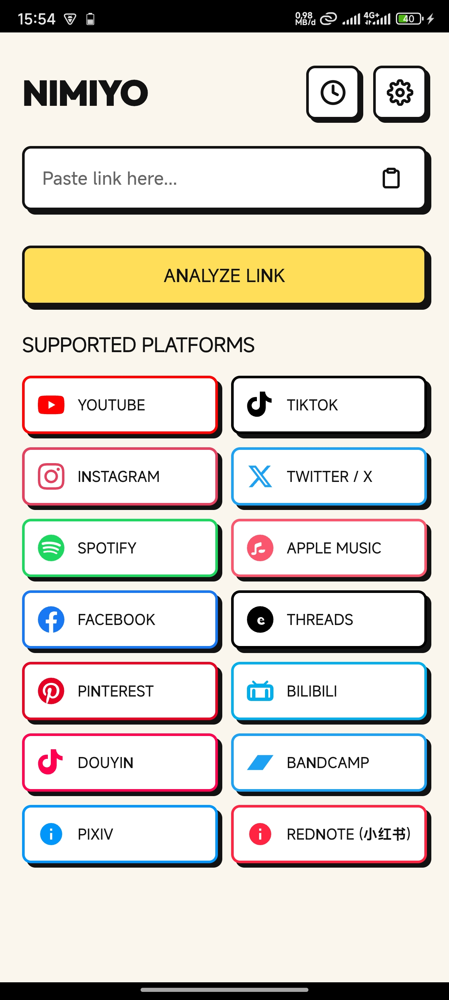
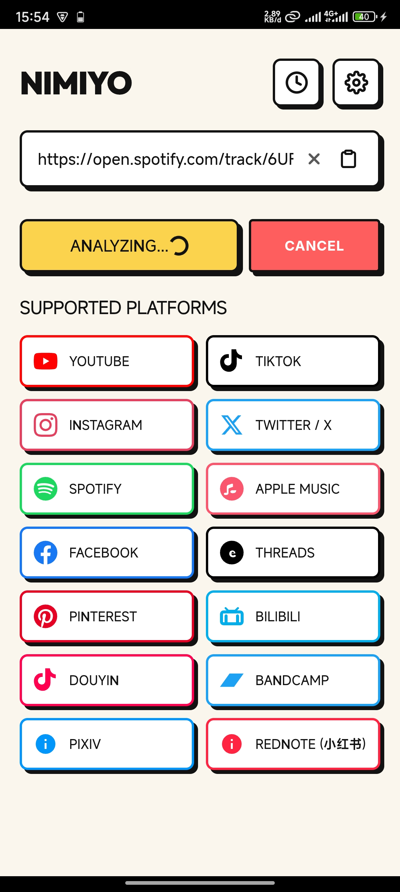
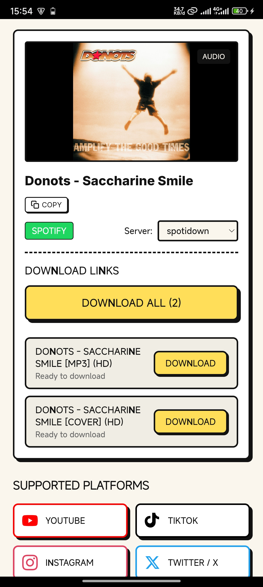
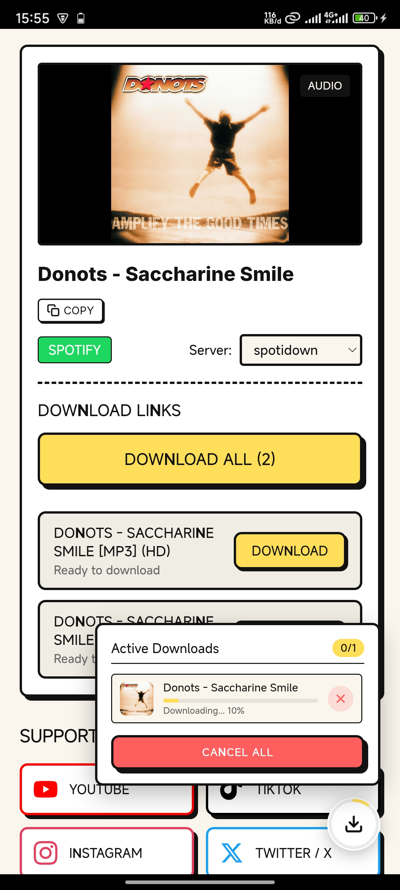
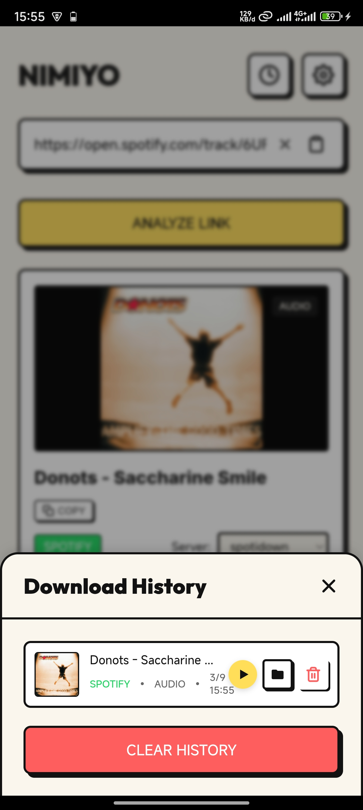
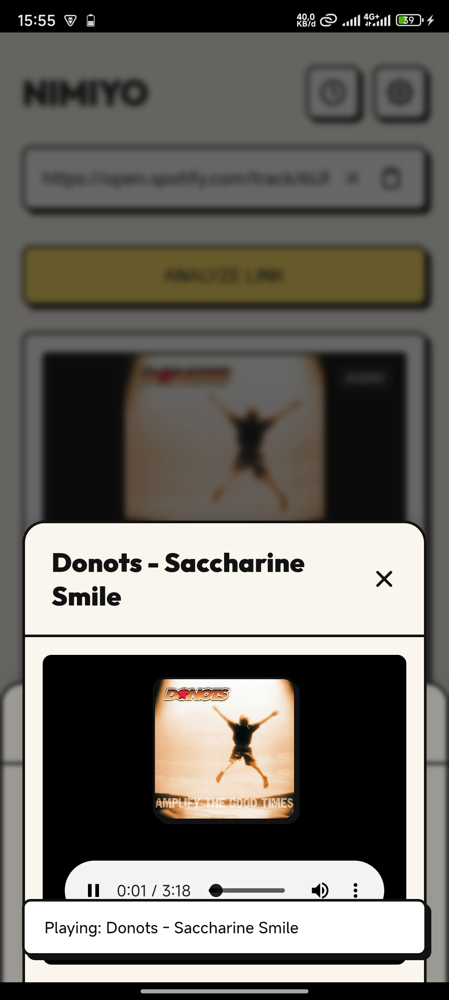

<div align="center">

  

  # 🐥 NIMIYO Downloader (Lite)

  **A Premium, Ultra-Fast & Lightweight Universal Media Downloader for Android**

  [](https://github.com/nimidz/Nimiyo-Downloader/releases)
  [](https://github.com/nimidz/Nimiyo-Downloader)
  [](https://github.com/nimidz/Nimiyo-Downloader)
  [](LICENSE)
  [](https://trakteer.id/nimidz)

  <br/>

  <p align="center">
    <b>Download videos, music, high-res photos, and audio tracks effortlessly from 14+ platforms without ads, popups, or limits.</b>
  </p>

  <p align="center">
    <a href="https://github.com/nimidz/Nimiyo-Downloader/releases/latest">
      
    </a>
    <a href="https://trakteer.id/nimidz">
      
    </a>
  </p>

</div>

---

## 📱 App Screenshots

<div align="center">

| 1. Home / Analyzer | 2. Download Options | 3. History & Storage |
| :---: | :---: | :---: |
|  |  |  |

| 4. Built-in Player | 5. Settings Menu | 6. Rules & Guidelines |
| :---: | :---: | :---: |
|  |  |  |

</div>

---

## ✨ Key Features

- ⚡ **All-In-One Universal Downloader**: Support for videos, audio tracks, covers, slideshows, and photo carousels.
- 🎨 **Neobrutalist Aesthetic UI/UX**: Distinctive bold borders, high-contrast accents, haptic feedback, custom typography (*MiSans, Inter, Outfit, Space Mono*), and fluid Dark Mode.
- 📲 **Quick Save Share Sheet**: Share links from any app (TikTok, YouTube, Instagram) directly into NIMIYO's floating bottom sheet without leaving your current app.
- 🗂️ **Organized Media Storage**:
  - 🎬 `Download/Nimiyo/VideoYo/`
  - 🎵 `Download/Nimiyo/AudioYo/`
  - 🖼️ `Download/Nimiyo/ImageYo/`
- 📁 **Direct Folder Opener**: One-tap direct folder navigation into Xiaomi File Explorer, Samsung My Files, Google Files, and ZArchiver.
- 🔄 **Auto Server Switch & Smart Retry**: Automatically falls back to alternative backend scraper servers if a primary host or CDN is busy.
- 🚀 **In-App Auto Update**: Effortlessly check and install new APK updates directly inside the app with native install permission integration.
- 🌍 **Multilingual Localization**: Complete native language auto-detection and parity for **English**, **Bahasa Indonesia**, **简体中文**, and **日本語**.
- 🛡️ **Community Guidelines & Rules**: Built-in Terms of Use modal prohibiting harmful, violent, and NSFW content.
- 🔒 **Privacy First**: Built-in Incognito Mode, zero tracking, and local history management.

---

## 🌐 Supported Platforms

| Platform | Video | Audio / MP3 | Photos / Album | Status |
| :--- | :---: | :---: | :---: | :---: |
| **YouTube** | ✅ | ✅ | ❌ |  |
| **TikTok** | ✅ (No Watermark) | ✅ | ✅ (Slideshow) |  |
| **Instagram** | ✅ (Reels/Stories) | ✅ | ✅ (Carousels) |  |
| **Spotify** | ❌ | ✅ (320kbps MP3) | ✅ (Cover Art) |  |
| **Apple Music** | ❌ | ✅ (HQ M4A/MP3) | ✅ (Cover Art) |  |
| **Twitter / X** | ✅ (HD) | ❌ | ✅ |  |
| **Facebook** | ✅ (Reels/Watch) | ✅ | ✅ |  |
| **Threads** | ✅ | ❌ | ✅ |  |
| **Pinterest** | ✅ | ❌ | ✅ (High-Res) |  |
| **Bilibili** | ✅ | ✅ | ❌ |  |
| **Douyin** | ✅ (No Watermark) | ✅ | ✅ |  |
| **Bandcamp** | ❌ | ✅ (Lossless/MP3) | ✅ |  |
| **Pixiv** | ❌ | ❌ | ✅ (Full Size) |  |
| **RedNote (小红书)** | ✅ | ❌ | ✅ (HD Images) |  |

---

## 🛠️ Repository Structure

```
Nimiyo-Downloader/
├── assets/                   # Media Assets & Showcase Screenshots
│   ├── icon_untukdi_aboutthisapp.webp
│   ├── nimiyo_icon.webp
│   └── screenshots/
│       ├── screenshot_1.jpg  # Home Screen
│       ├── screenshot_2.jpg  # Download Links
│       ├── screenshot_3.jpg  # History Modal
│       ├── screenshot_4.jpg  # In-App Player
│       ├── screenshot_5.jpg  # Settings
│       └── screenshot_6.jpg  # Rules Modal
├── src/                      # Web UI & Application Logic
│   ├── index.html            # Main Application UI
│   ├── app.js                # State Management & Localization
│   ├── index.css             # Neobrutalist Design System Tokens
│   ├── platform.js           # Media Analysis & Platform Engine
│   ├── share.html            # Native Quick Save Floating Panel
│   └── share.js              # Quick Save Logic & Bridge
├── android/                  # Native Android Platform (Capacitor)
│   ├── app/src/main/java/nimiyo/litedownloader/
│   │   ├── MainActivity.java      # Main App Container
│   │   ├── ShareActivity.java     # Quick Save Native Bottom Sheet
│   │   └── MediaSaverPlugin.java  # MediaStore Storage & APK Installer Plugin
│   └── app/src/main/AndroidManifest.xml
├── build.js                  # Scrapr Engine Bundler & Asset Syncer
├── version.json              # In-App Auto Update Manifest
└── capacitor.config.json     # Capacitor Configuration
```

---

## 🚀 Building from Source

### Prerequisites
- **Node.js**: v18 or higher
- **JDK**: Java 17 or 21
- **Android SDK**: Android API 34+

### Step-by-Step Build
1. **Clone the repository**:
   ```bash
   git clone https://github.com/nimidz/Nimiyo-Downloader.git
   cd Nimiyo-Downloader
   ```

2. **Install dependencies**:
   ```bash
   npm install
   ```

3. **Bundle web assets & sync Capacitor**:
   ```bash
   node build.js
   npx cap copy
   ```

4. **Compile Release APK**:
   ```bash
   cd android
   .\gradlew.bat assembleRelease
   ```
   *The compiled APK will be located at `android/app/build/outputs/apk/release/app-release.apk`.*

---

## 🌐 Connect with Developer

- 📸 **Instagram**: [@nimidzy](https://instagram.com/nimidzy)
- 🎵 **TikTok**: [@nimidz](https://tiktok.com/@nimidz)
- 🎬 **YouTube**: [@nimidz](https://youtube.com/@nimidz)
- 🐙 **GitHub**: [@nimidz](https://github.com/nimidz)
- ☕ **Support / Donasi**: [Trakteer.id/nimidz](https://trakteer.id/nimidz)

---

## 🤝 Acknowledgements & Credits

- Built with ❤️ by [nimidz](https://github.com/nimidz)
- Powered by `scrapr` engine by [@coflyn](https://github.com/coflyn)
- Built with [Capacitor](https://capacitorjs.com/)

---

<div align="center">
  <sub>Made with passion for media freedom. © 2026 NIMIYO.</sub>
</div>
